# YOLO-VOC

This is a repo about modified implementation of YOLO family (now updated to **YOLOv4**) written in PyTorch from scratch, and it's also the first time I try to implement an object detection model myself.  
I'm using `PyTorch 2.10.0+cu128` in `Python 3.12.0`.  

| Model | Train Dataset | Val Dataset | Epochs | Input Size | Test Size | mAP@0.5 | mAP@0.6 | mAP@0.75
| :--- | :--- | :---| :--- | :--- | :--- | :--- | :--- | :--- |
| YOLOv1 | VOC2007 trainval + VOC2012 trainval | VOC2007 test | 80 | multi-scale | 416x416 | 69.62% | 61.05% | 39.11% |
| YOLOv2 | VOC2007 trainval + VOC2012 trainval | VOC2007 test | 80 | multi-scale | 416x416 | 73.84% | 65.98% | 44.82% |
| YOLOv3 | VOC2007 trainval + VOC2012 trainval | VOC2007 test | 80 | multi-scale | 416x416 | 81.38% | 75.96% | 55.01% |
| YOLOv4 | VOC2007 trainval + VOC2012 trainval | VOC2007 test | 80 | multi-scale | 416x416 | 84.26% | 79.84% | 64.53% |

## Requirements
```
matplotlib==3.10.8
numpy==2.4.3
opencv_python==4.13.0.92
torch==2.10.0+cu128
torchvision==0.25.0+cu128
tqdm==4.67.3
```

## Dataset
The dataset comes from PASCAL VOC 2007 and 2012: [PASCAL VOC](https://www.kaggle.com/datasets/vijayabhaskar96/pascal-voc-2007-and-2012). It has a total of 20 categories.  
I used VOC2007 trainval + VOC2012 trainval to train the model (about 16,551 images) and VOC2007 test to evaluate the model's performance (about 4,952 images).  
*JPEGImages* folder includes original images; *Annotations* folder includes annotation files for each image; *ImageSets* folder recorded the split information of the dataset.

## Train
To start training, run the command -
```
python train.py
```
You can adjust hyperparameters in ```config.py``` according to your own hardware (It is recommended to train on a GPU). I used an NVIDIA GeForce RTX 3080 Ti GPU (12GB VRAM).

## Test
To test your trained model, run the command -
```
python test.py
```
It will randomly select an image in the test set, and then output the model's prediction results. You can also try your own images!

## Results
*Images it had never seen before*:  
<br>
<p align="center">
  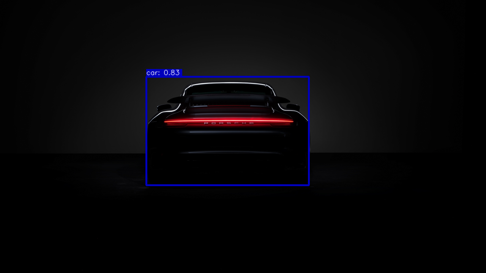
  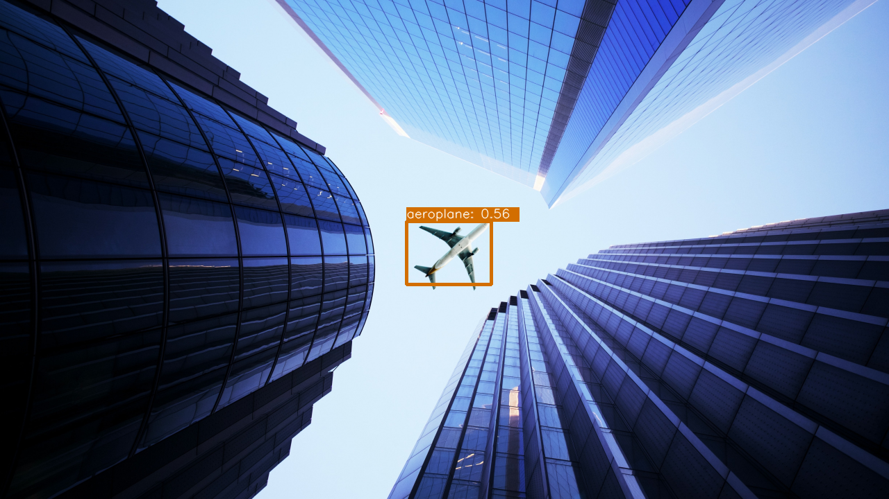
  <br>
  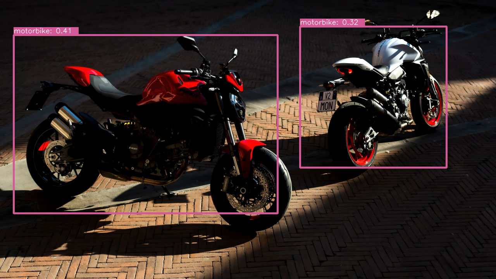
  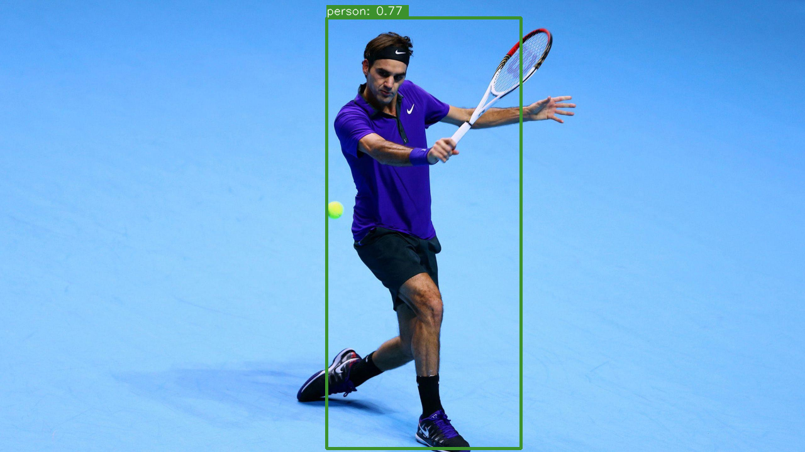
  <br>
  <em><strong>YOLOv1 Results</strong></em>
</p>
<br>
<p align="center">
  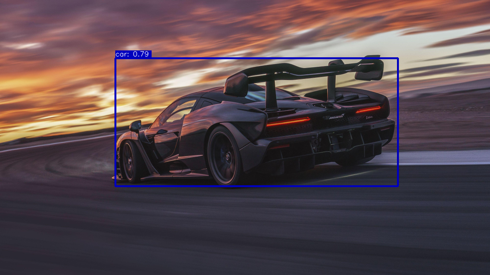
  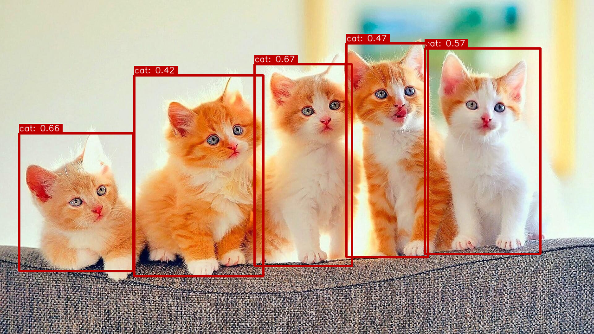
  <br>
  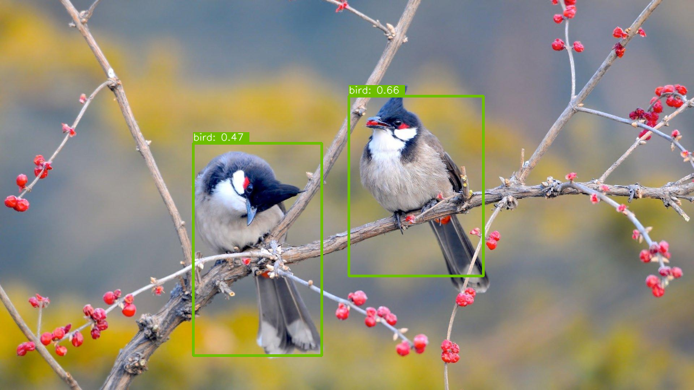
  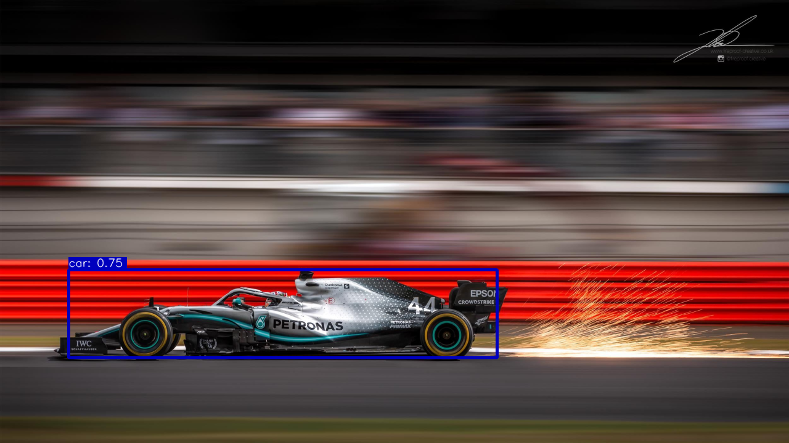
  <br>
  <em><strong>YOLOv2 Results</strong></em>
</p>
<br>
<p align="center">
  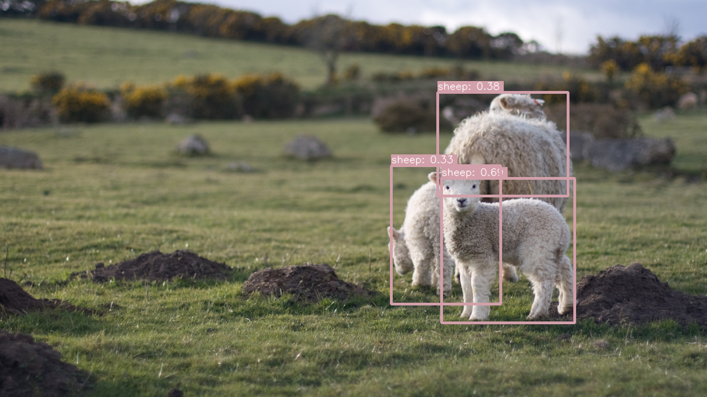
  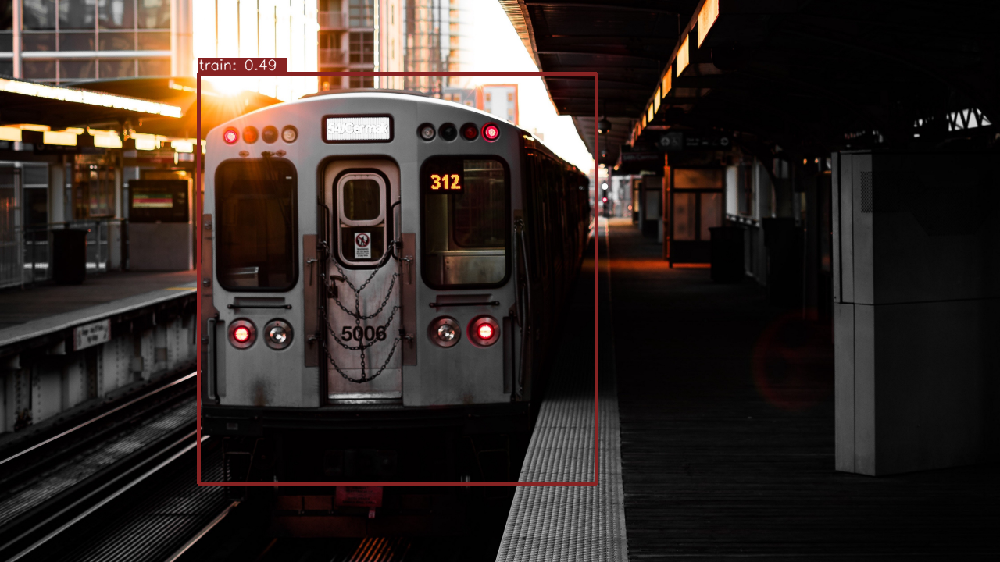
  <br>
  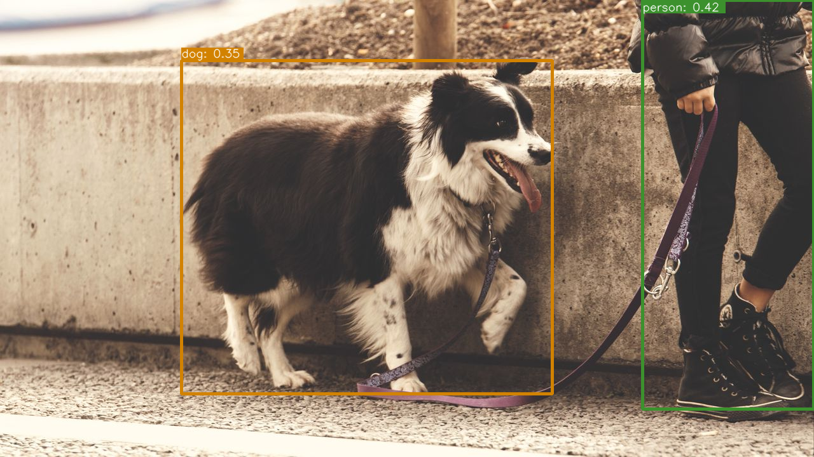
  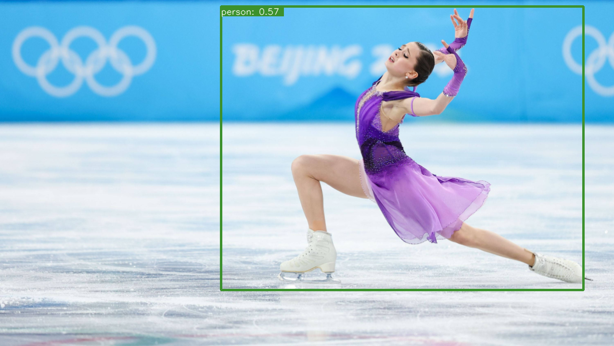
  <br>
  <em><strong>YOLOv3 Results</strong></em>
</p>
<br>
<p align="center">
  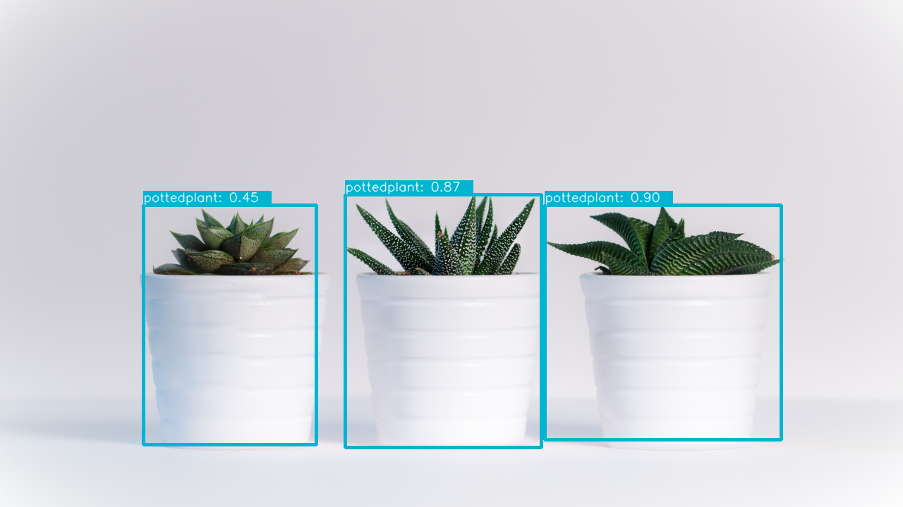
  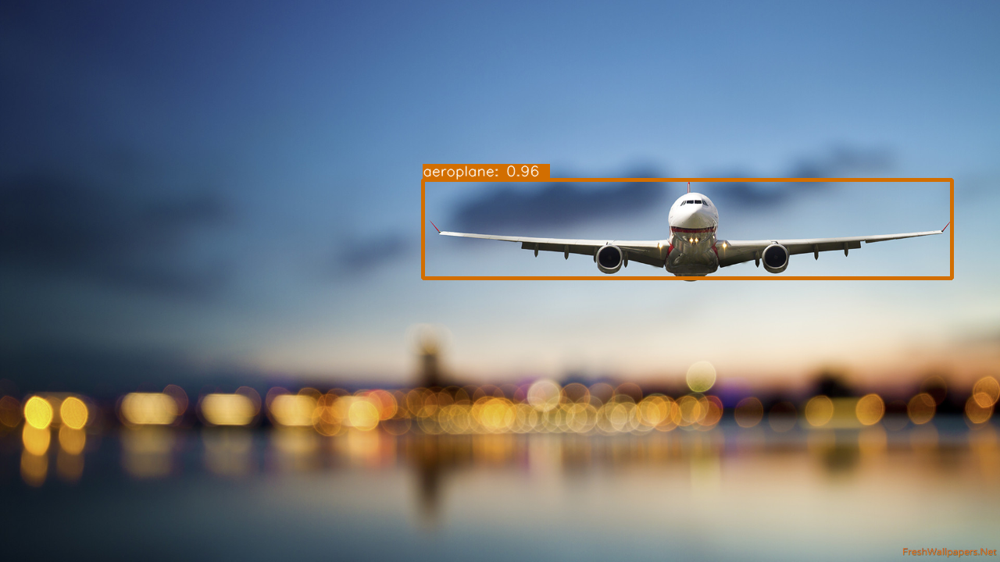
  <br>
  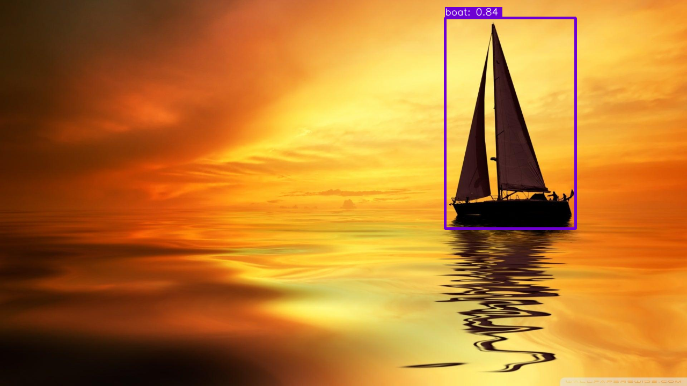
  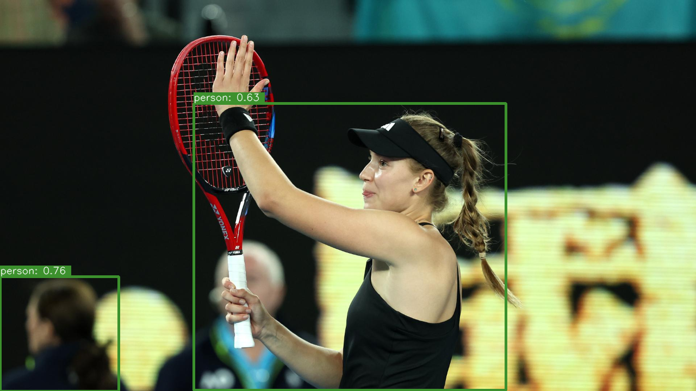
  <br>
  <em><strong>YOLOv4 Results</strong></em>
</p>

## Acknowledgement
This repo is inspired by [RT-ODLab](https://github.com/yjh0410/RT-ODLab). Thanks for the excellent works.
