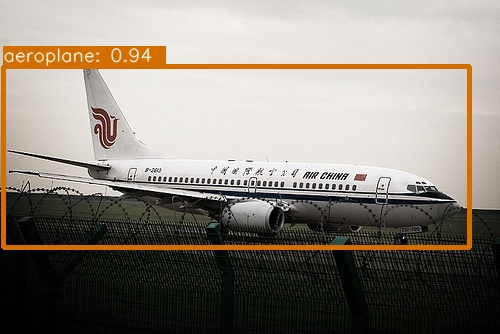
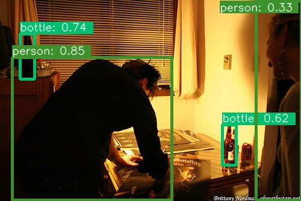
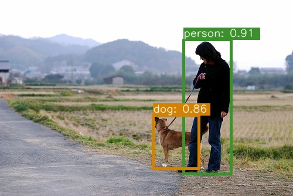
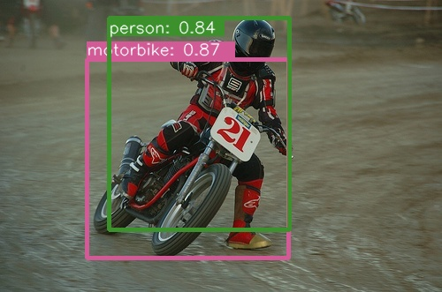
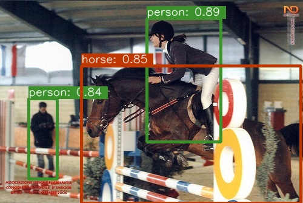
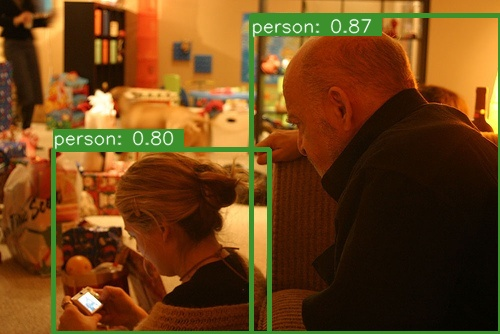
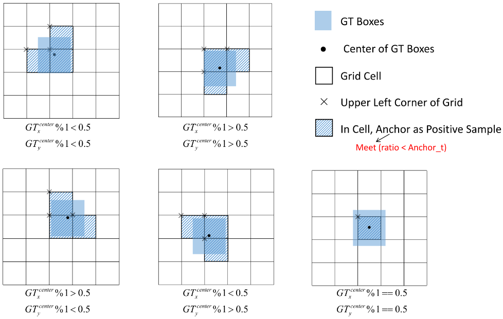
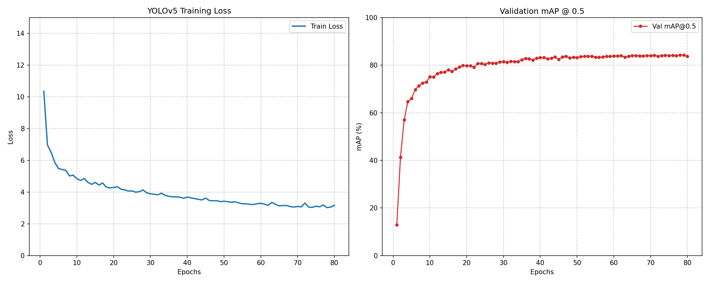

# YOLOv5-VOC

This is a modified **YOLOv5** implementation.

| Model  | Train Dataset                       | Val Dataset  | Epochs | Input Size  | Test Size | mAP@0.5 | mAP@0.6 | mAP@0.75 |
|:-------|:------------------------------------|:-------------|:-------|:------------|:----------|:--------|:--------|:---------|
| YOLOv5 | VOC2007 trainval + VOC2012 trainval | VOC2007 test | 80     | multi-scale | 416x416   | 84.31%  | 80.03%  | 65.39%   |

## Structure

```
├── data/
|   └── VOCdevkit
├── model/
|   ├── __init__.py
|   ├── yolov5_backbone.py
|   ├── yolov5_neck.py
|   ├── yolov5_pafpn.py
|   ├── yolov5_head.py
|   └── yolov5.py
├── config.py
├── voc.py
├── augmentation.py
├── matcher.py
├── loss.py
├── eval.py
├── train.py
└── test.py
```

<em>Read files in order:</em>
> config.py -> yolov5.py -> voc.py -> augmentation.py -> matcher.py -> loss.py -> eval.py -> train.py -> test.py

## Some Results

<br>
<p align="center">
  
  
  
  <br>
  
  
  
</p>

## What's new?

#### <em>Backbone Network</em>:

YOLOv5 continues to use the **CSPDarknet** architecture as its backbone network based on the CSP structure,
incorporating the **SPPF** module and **PaFPN** structure. The distinction lies in the introduction of a model scaling
strategy, which enables YOLOv5 variants with different sizes (nano, small, medium, large, huge). Here, I have employed
*cspdarknet_large* as the backbone for my experiments.

#### <em>Ground Truth Matching</em>:

**Initial Selection via Dual-Criterion**:
The code implemented two distinct logics to determine which anchor boxes are responsible for a given ground truth:

- Aspect Ratio Assignment: This is the default matching strategy. Instead of calculating
  IoU, it computes the ratio between the GT and the anchor's width and height. A match is considered successful if
  both $\max(w_{gt}/w_{at}, w_{at}/w_{gt})$ and $\max(h_{gt}/h_{at}, h_{at}/h_{gt})$ are below the predefined
  anchor threshold.
- IoU Assignment: In cases where no anchors satisfy the aspect ratio criteria, the code falls back to the iou assignment
  logic, just like I implemented before.

**Grid Expansion**:
Assuming a Ground Truth (GT) box falls into a specific grid cell within a prediction branch, that cell has four
neighboring grids: left, top, right, and bottom. Based on the center location of the GT box, the two nearest
neighboring grids are also designated as prediction grids. Consequently, a single GT box can be predicted by up to three
grid cells. There are five possible scenarios for this assignment (note: if the center point of the GT box falls exactly
in the middle of a cell, then only that primary cell is selected).

<br>
<p align="center">
  
  <br>
  <em><strong>Grid Expansion</strong></em>
</p>

## Train

To start training, run the command -

```
python train.py
```

I used Automatic Mixed Precision (AMP) to accelerate the training process and reduce memory consumption without
sacrificing numerical precision. Furthermore, I used a Cosine Annealing scheduler with a linear warm-up phase during
training. Additionally, Multi-scale Training was implemented, where the input image resolution was randomly sampled
every epoch.

<br>
<p align="center">
  
  <br>
  <em><strong>Loss and mAP@0.5</strong></em>
</p>

## Test

To test your trained model, run the command -

```
python test.py
```

It will randomly select an image in the test set, and then output the model's prediction results. You can also try your
own images!

<br><br>
<em><strong>My pre-trained
model:</strong></em> [YOLOv5](https://drive.google.com/drive/folders/1huBHdrOeEB2dET3ULqZwvwcUG2lx3yb6?usp=sharing)
